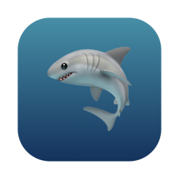

<p align="center">
  
</p>

# fishtank

A fish tank for your desk, except it plays [MilkDrop](https://www.geisswerks.com/milkdrop/)
visuals. A small always-on-top window of classic Winamp-era graphics that reacts to
whatever audio your Mac is playing — Spotify, YouTube, anything — captured with Core
Audio process taps, no virtual audio device or routing setup required.

https://github.com/user-attachments/assets/2975fa65-dfa4-4aa2-9bd6-b1f6d9cdf1b3

It's meant to sit on your desktop like a piece of furniture: drag it into a corner,
let it run, forget about it. It sleeps when the music stops.

Rendering is done by [libprojectM](https://github.com/projectM-visualizer/projectm).
Requires macOS 14.4+.

## Download (beta)

Grab the latest `Fishtank-x.y.z-beta.zip` from
[Releases](../../releases), unzip, and drag `Fishtank.app` into Applications.
Apple Silicon and Intel, macOS 14.4+.

The beta is not yet notarised, so the first launch needs one extra step:
right-click the app and choose Open, or allow it afterwards under System
Settings → Privacy & Security. On first launch macOS also asks permission to
record system audio — that is the visualizer's input; nothing is recorded or
stored.

## Building

Requires Xcode, CMake, and [XcodeGen](https://github.com/yonaskolb/XcodeGen).

```sh
git clone --recurse-submodules <repo>
./scripts/build-libprojectm.sh
xcodegen generate
xcodebuild -project Fishtank.xcodeproj -scheme Fishtank build
```

## Credits and licensing

See [CREDITS.md](CREDITS.md) and [THIRD-PARTY-NOTICES.md](THIRD-PARTY-NOTICES.md).
libprojectM is LGPL-2.1 and linked dynamically; licence texts are in
[licenses/](licenses/).
